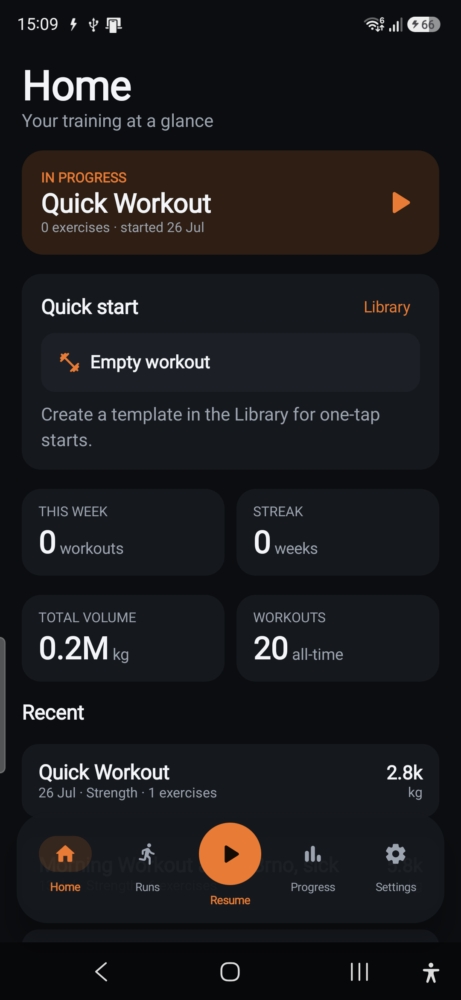
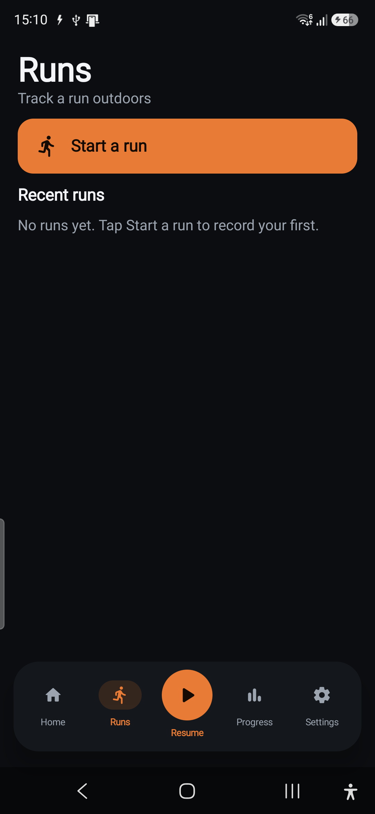
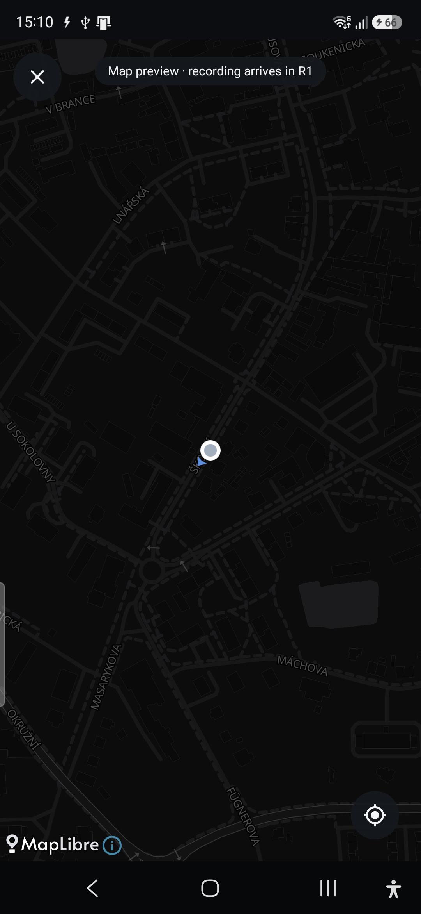
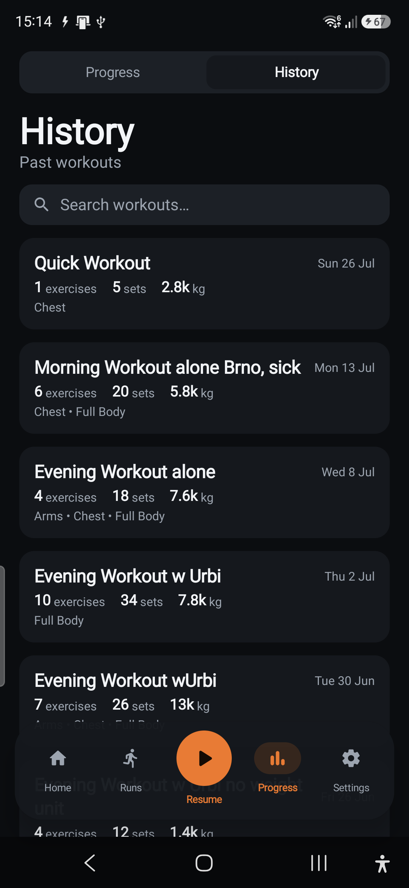
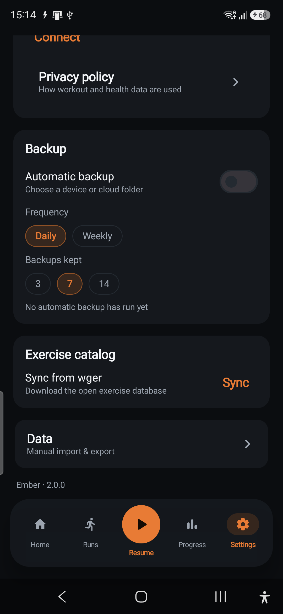

# Run Mode — Phase R0 report (Foundation)

**Branch:** `feature/run-mode` · **Ships toward:** v2.1.0 · **Verified on:** Galaxy A56 (`SM-A566B`, Android 16)

R0 lays the foundation for Run Mode: the app is rebranded **Ember**, the shell gained a **Runs** tab
and a **Lift/Run start chooser**, History moved under **Progress**, a dark **MapLibre** map follows
your location, and the **Room v5** run data model + a pure `domain/run` layer are in place — all
additive, with the strength app untouched. No live GPS recording yet; that is R1.

## What shipped

### 1. Rebrand → Ember
- `app_name` = **Ember** (`res/values/strings.xml`) → launcher label + splash use it.
- Settings footer now **"Ember · 2.0.0"** (`versionName` stays `2.0.0`; the line ships as `2.1.0`
  when R0–R5 land). Privacy-policy copy and the root `README.md` heading rebranded.
- `applicationId` **unchanged** (`com.lukr99.workout`) — the build installed in place over the
  existing app (Streamed Install / `install -r` success), so no data was lost.

### 2. Shell (locked decisions)
- Bar is now **`Home · Runs · (＋ Start) · Progress · Settings`** (`ui/Navigation.kt` `Tab`).
- **`＋ Start`** opens a **Lift/Run chooser** sheet (`ui/components/StartChooserSheet.kt`): Lift →
  existing `createWorkoutSession` live workout; Run → the live-run flow. When a lift is already live
  the center keeps its **▶ Resume** behaviour (resumes directly), so the strength path is unchanged.
- **`Runs`** is the new hub (`ui/run/RunsScreen.kt`) in History's old slot: a prominent *Start a run*
  plus a recent-runs list (empty state for now).
- **History moved into Progress** (`ui/screens/ProgressHubScreen.kt`): a `Progress | History`
  segmented toggle hosts the existing `ProgressScreen` and `HistoryScreen` unchanged, preserving
  search + `WorkoutDetail` drill-in. History is no longer its own tab.

### 3. Location + map
- Manifest: `ACCESS_FINE_LOCATION` (+ coarse), `POST_NOTIFICATIONS`, `FOREGROUND_SERVICE` (+
  `…_LOCATION`, declared ahead of R1's service). **No background-location** — a foreground service
  covers screen-off tracking (per `architecture.md`).
- **MapLibre Native** (`org.maplibre.gl:android-sdk:11.5.2`) behind a provider-agnostic
  `ui/run/components/MapView.kt` (`RunMap`) with full Compose lifecycle forwarding. Dark **vector**
  basemap via `data/map/MapStyle.kt`.
- **`LiveRunScreen`** (R0 stub): renders the dark map, requests fine location just-in-time with a
  rationale card, then shows the **blue location dot** and **follows** you (recenter FAB). No
  recording — a "Map preview · recording arrives in R1" badge makes that explicit.

### 4. Run data model + Room v5 (additive, non-destructive)
- `data/run/RunEntities.kt`: `runs`, `run_points`, `routes`, `route_points` (child points cascade;
  `runs.routeId`/`sessionId` are indexed loose refs, **not** FKs). `RunDao` + `RunRepository`
  (the only run IO boundary; owns polyline encode/decode).
- `WorkoutDb` → **v5** with `MIGRATION_4_5` (four `CREATE TABLE`s copied verbatim from the exported
  schema). **`app/schemas/5.json` checked in.** No destructive fallback.
- `WorkoutMigrationTest` extended: a `4→5` case validates the migrated schema against `5.json`,
  inserts a run + point, and asserts child points **cascade** on run delete. The `1→…` and `3→…`
  fixtures now migrate all the way to 5. **All 3 instrumented migration tests pass on device.**

### 5. Pure `domain/run` + codec (JVM unit-tested)
- `domain/run/RunModels.kt` — `@Serializable` `Run`, `Route`, `TracePoint`, `RoutePoint`, `Split`
  (Android-free; same wire conventions as the strength model).
- `domain/run/Pace.kt` — haversine, trace distance, speed, pace (sec/km + /mi), elevation gain,
  **interpolated per-km/mi splits**, and pace/duration formatting.
- `domain/run/Polyline.kt` — Google encoded-polyline codec (verified against the canonical reference
  vector + round-trips).
- `ExportBundle` → **1.5**: adds `runs` + `routes` (readers still accept `1.0`–`1.5`; a pre-Run
  export defaults them empty). `AppContainer.runRepository` wired (additive lazy).

## Verification

- **Unit tests:** `./gradlew testDebugUnitTest` → **BUILD SUCCESSFUL** (new `PaceTest`,
  `PolylineTest`, and extended `ExportBundleJvmTest` green; strength suites unaffected).
- **Instrumented:** `connectedDebugAndroidTest --tests WorkoutMigrationTest` → **3/3 pass** on the A56.
- **On-device:** built (`assembleDebug`, MapLibre `libmaplibre.so` packaged), installed in place,
  and walked the shell:

| Shell (Home) | Runs hub | Live-run map | History under Progress | Ember footer |
|---|---|---|---|---|
|  |  |  |  |  |

Strength history (20 workouts, 0.2M kg, PRs, recovery map) survived the v4→v5 upgrade intact.

## Decisions & deviations

- **Tiles (dev):** the locked decision is MapLibre + **Protomaps/PMTiles, keyless**. For R0 dev the
  dark style is served by **OpenFreeMap** (`tiles.openfreemap.org/styles/dark`) — keyless and
  **PMTiles/Protomaps-backed** under the hood — so the map renders over the network on-device with
  nothing to sign. Everything routes through `MapStyle.DARK_VECTOR_STYLE_URL`, so swapping in a
  **bundled/self-hosted `.pmtiles`** for offline (an R5 concern) is a one-line change. No secrets in
  the repo.
- **Location engine:** the R0 stub uses MapLibre's `LocationComponent` with its default
  (framework-`LocationManager`) engine — no Play Services dependency. R1's `LocationService` will use
  `FusedLocationProvider` per the architecture.
- **Build toolchain (local only):** the LOCALAPPDATA SDK's `build-tools/35.0.0` + `platforms/android-35`
  are still detached on `E:`. This machine built against `C:\Program Files (x86)\Android\android-sdk`
  (platform 35, build-tools 36) via an **uncommitted** `local.properties` `sdk.dir` and a local
  `buildToolsVersion = "36.0.0"`. **The repo stays pinned to `35.0.0`** — that override is reverted
  before commit and must be re-applied locally (or `E:` reconnected) to build again.

## Handed to R1

The map, permissions, v5 tables, `RunRepository`, and `domain/run` math are the substrate for R1
(live run core): a `location` foreground service + `RunTracker` (distance/pace/splits/auto-pause), a
growing ember polyline on the map, start/pause/resume/finish, and saving the trace via
`RunRepository.saveRun`.
