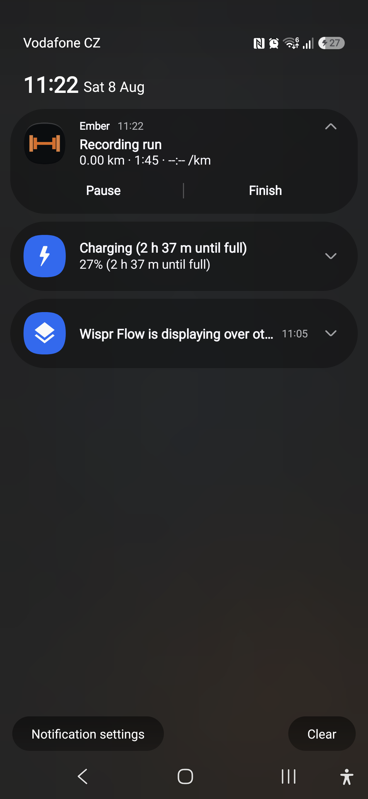
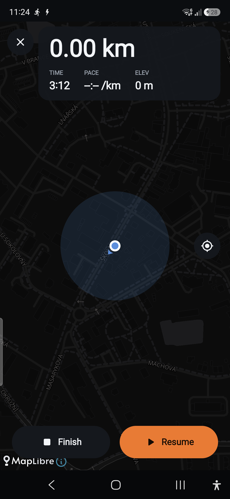
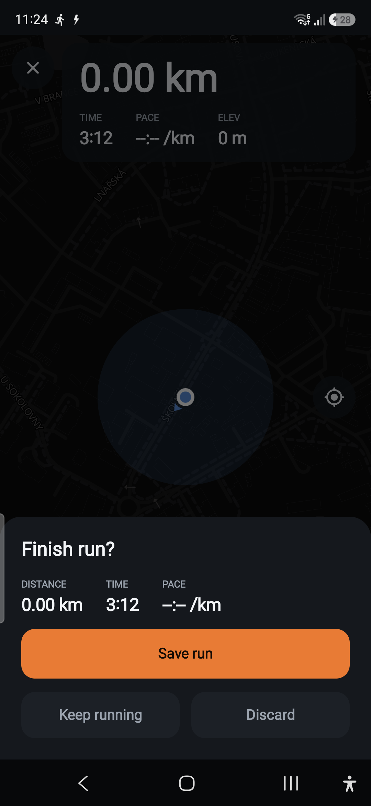
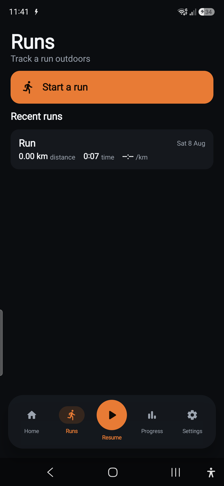
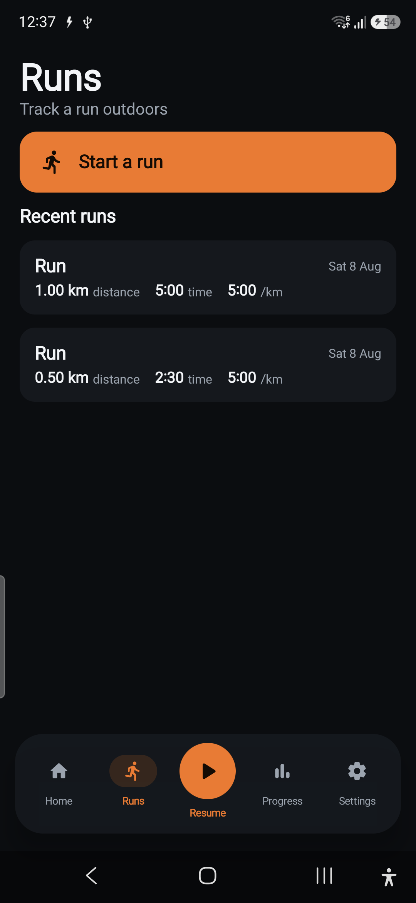

# Run Mode — Phase R1 report (Live run core)

**Branch:** `feature/run-mode` · **Ships toward:** v2.1.0 · **Verified on:** Galaxy A56 (`SM-A566B`, Android 16)

R1 makes runs real: a foreground GPS service records a live trace with distance / moving time / pace /
splits / auto-pause, the map draws a growing ember polyline, and start → pause/resume → finish saves
the run to the v5 tables. All additive; strength flows untouched.

## What shipped

### Pure recording brain — `domain/run/RunTracker`
A deterministic state machine (time injected, Android-free, **7 unit tests**) that turns a stream of
GPS samples + 1 Hz clock ticks into everything the UI and the saved `Run` need:
- Distance (haversine), **elapsed vs moving** time, current (rolling window) + average pace,
  elevation gain, per-km/mi **splits**.
- **Accuracy + jitter gating**: fixes worse than 30 m or moves under 3 m are dropped — *except* the
  **first fix, which always anchors the run** (so a run always has a start point even when the only
  fix available is a coarse network one; the gate then filters later fixes).
- **Auto-pause** with enter/exit hysteresis (moving clock stops when standing still; elapsed keeps
  running).

### Foreground service + persistence — `data/location/`
- `RunSessionController` — process-singleton source of truth: exposes `state`/`trace` `StateFlow`s,
  owns the tracker, and writes an on-disk **crash buffer** every accepted fix. `recoverIfNeeded()`
  salvages a run whose process was killed mid-recording into a saved run on next launch; `finish()`
  saves via `RunRepository` and clears the buffer (idempotent — a notification-STOP racing the
  on-screen Finish can't double-save).
- `LocationService` — `foregroundServiceType="location"` service streaming MapLibre's `LocationEngine`
  fixes (fused where Play Services is present — **no Play-Services dependency added**), ticking the
  tracker ~1 Hz, seeding the last-known fix at start, and posting an ongoing notification (distance ·
  time · pace) with **Pause / Resume / Finish** actions. Screen-off sampling needs no background-
  location permission.

### UI — `ui/run/`
- `LiveRunViewModel` re-exposes the controller's flows and translates intents into controller calls +
  service start; because the controller is a singleton, reopening the screen **re-attaches** to the
  live run for free.
- `LiveRunScreen` — dark map with the growing **ember trace**, big live metrics, start→**3-2-1
  countdown**→record, pause/resume, and a finish sheet (Save / Keep running / Discard). Closing the
  screen leaves the run recording in the background.
- `MapView` draws the trace as a GeoJSON `LineLayer` and follows location.

## On-device verification (A56)

| Live recording | Notification | Paused | Finish sheet | Saved in hub |
|---|---|---|---|---|
|  |  |  |  |  |

Confirmed on the phone:
- **Countdown → record**: the 3-2-1 overlay runs, then the foreground service starts (🏃 status-bar
  icon) and the metrics clock ticks.
- **Ongoing notification** shows *"Ember · Recording run · 0.00 km · m:ss · pace"* and updates live;
  its **Pause** flips it to *"Run paused"* + **Resume**, and **Finish** ends + saves the run.
- **In-app Pause** toggles to **Resume** and freezes the clock; **re-opening** the run screen mid-run
  re-attaches to the same run (elapsed continued, not reset).
- **Finish → Save** persists the run; it appears in the **Runs hub** (`Run · 0.00 km · 0:07 ·
  Sat 8 Aug`) via the reactive `observeRuns()` flow.
- Unit tests green: `RunTracker` (7), `Pace` (8), `Polyline` (5); `assembleDebug` builds.

### Bug found + fixed on device
The first on-device finish saved **nothing**. Logging showed fixes *were* arriving but every one was
rejected — indoors the only fix is a ~100 m network location, over the 30 m accuracy gate → empty
trace → `finish()` correctly skipped an empty run. Fix: **the first fix now anchors the run regardless
of accuracy** (plus a last-known seed at service start); the gate still filters *subsequent* poor
fixes. Covered by a new unit test (`firstFixAnchorsEvenWhenInaccurate`). After the fix, the run saved
and rendered in the hub.

## Notes / limitations

- **Distance/polyline growth is 0 on the device here because testing was stationary indoors** (only
  the anchor fix, no movement > 3 m). The distance/pace/split/auto-pause math is fully covered by
  `RunTrackerTest`; the growing ember line + non-zero distance need an **outdoor run**, which is the
  definitive real-world confirmation (owner to run one).
- A "Wispr Flow" `SYSTEM_ALERT_WINDOW` overlay on the test device intercepted automated taps on the
  modal finish sheet, so Finish was driven via the **notification** action (same `finish()` path). Not
  an app issue.
- The debug APK triggers a One-UI "16 KB page-size" warning (`libmaplibre.so` not 16 KB-aligned). It's
  a non-blocking debug-build warning; 16 KB alignment for release packaging is an R5 concern.
- One 0.00 km test run was saved on the device during verification; it's deletable once R2 adds run
  detail/delete.

## Fixes after owner testing (2nd pass)

Real-device use turned up three bugs, all fixed + covered by the new harness:

1. **Stale re-entry** — the singleton controller wasn't reset after `finish()`, so reopening the Run
   screen showed a dead *"31 s, can't pause/finish"* state. `finish()`/`discard()` now reset the
   tracker to Idle, and the screen treats any non-active state as "Start". (Asserted by
   `RunSessionControllerTest.recordsAndSavesRun`: phase == Idle after finish.)
2. **Center "Resume" opened a phantom lift** — with a live run, the center action now resumes the
   **run** (priority over a stale lift session), then a live lift, then the chooser.
3. **Under-capture** — the 3 m min-move gate at ~1 s sampling dropped every fix slower than ~3 m/s
   (≈5:30/km), so ordinary jogging under-counted distance. Lowered to **1.5 m** (captures anything
   above ~1.5 m/s; at-rest jitter still handled by the gate + auto-pause).

## Test harness (no more vision-driven checking)

Two repeatable tools replace driving the app by hand:

- **`RunSessionControllerTest`** (instrumented, 3 cases) — drives the full GPS→tracker→controller→
  repository→Room path with a **synthetic route + injected clock** and asserts distance, points,
  pace, idle-reset, discard, and crash-buffer recovery. Fully automatic; runs in CI.
- **`RunSimReceiver`** (debug builds only) + **`tools/run-sim.ps1`** — a **GPS route simulator**: one
  command replays a synthetic run straight through the live controller (a 10-min run plays in ~5 s):
  ```
  .\tools\run-sim.ps1 -Meters 1000 -Seconds 300 -Bearing 45
  ```
  Verified on the A56 — the hub then shows real captured runs (`1.00 km · 5:00 · 5:00/km` and
  `0.50 km · 2:30 · 5:00/km`), confirming capture + distance/pace + save end-to-end without going
  outside:

  

  (Send with the explicit component — `-a … -n …/.data.location.RunSimReceiver`; action-only
  broadcasts to a manifest receiver are blocked by Android's background limits. The script does this.)

## Handed to R2
Runs now persist with full traces + encoded polylines. R2 builds the run **detail** screen (map,
split table, pace/elevation charts, delete), `RunStats` (weekly distance, pace trend, PRs), a Running
section in **Progress**, and Health Connect export.
