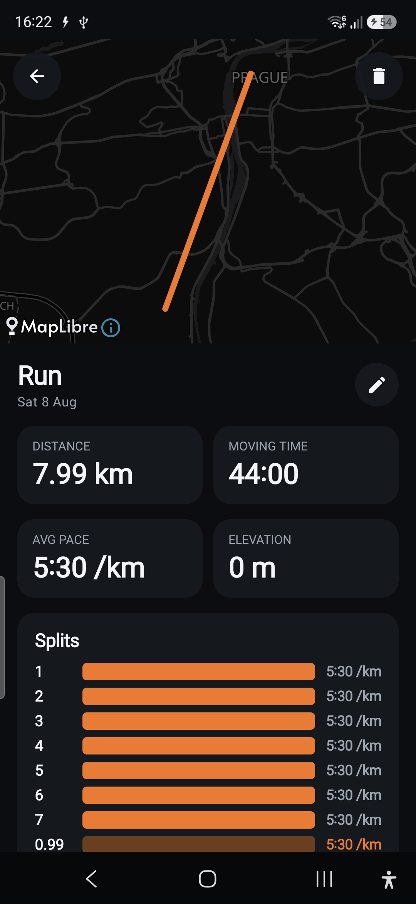
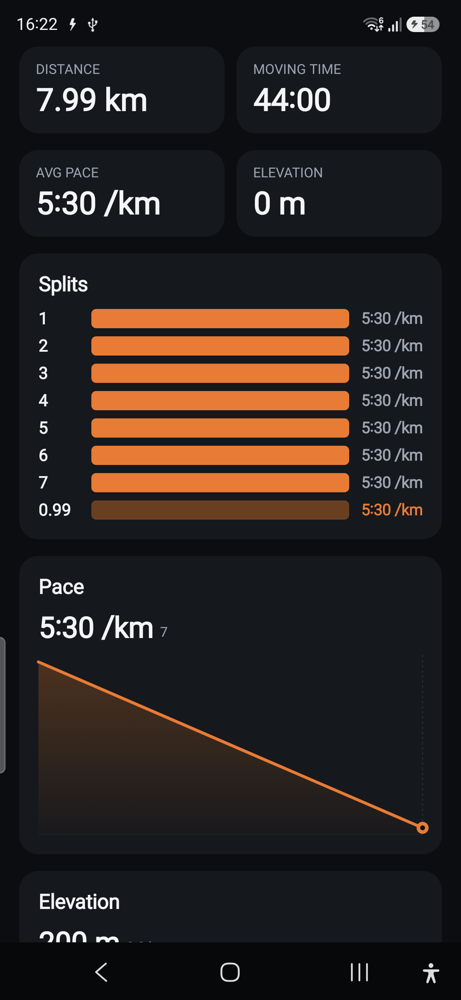
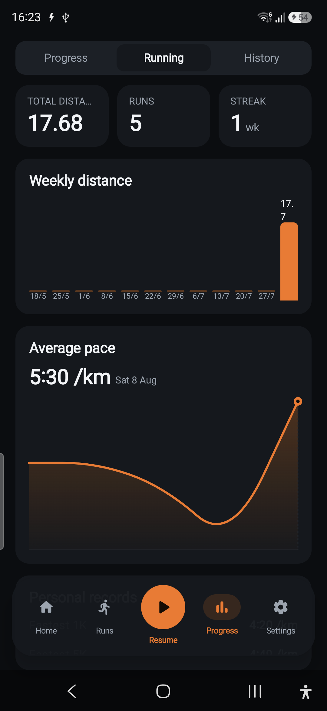
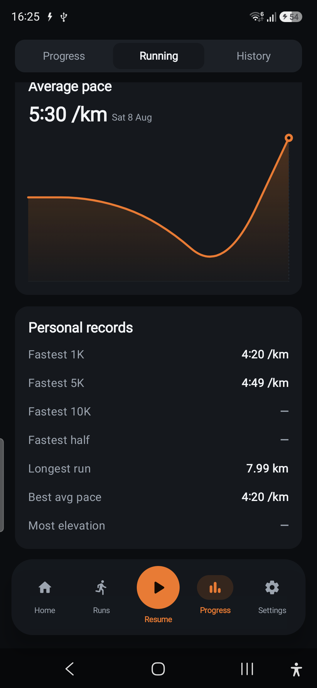

# Run Mode — Phase R2 report (Run detail, history & stats)

**Branch:** `feature/run-mode` · **Ships toward:** v2.1.0 · **Verified on:** Galaxy A56 (`SM-A566B`, Android 16)

R2 makes recorded runs browsable and feeds statistics: a full **run detail** screen, a pure
**`RunStats`** engine (trends + PRs), a **Running** section in the Progress tab, and idempotent
**Health Connect** export. All additive; strength + the R1 live flow untouched.

## What shipped

### Pure stats — `domain/run/RunStats` (unit-tested, 8 cases)
Aggregates `List<Run>` into everything the Progress section shows — no Android, deterministic (zone +
"now" injected):
- **Totals** (distance-weighted pace), **weekly/monthly** distance buckets (Monday-start, empty weeks
  included), **pace trend** (chronological), **current streak** (consecutive active weeks).
- **Personal records**: fastest **1k/5k/10k/half** via a forward two-pointer over cumulative
  distance with time interpolation (`fastestTimeForDistanceMs` — the fastest continuous window of an
  exact target distance *within* a run), plus longest run, most elevation, best average pace.

### Run detail — `ui/run/RunDetailScreen` + `SplitTable`
- Full **map trace** (reuses `RunMap`, new `fitTrace` fits the camera to the polyline bounds), hero
  stats (distance / moving time / avg pace / elevation), a per-km/mi **split table** (bars scaled to
  the fastest split), and **pace + elevation charts** (reuse `ProgressChart`).
- **Edit notes** (lightweight `RunRepository.updateRunNotes` — no trace rewrite) and **delete**
  (`deleteRun`, cascade) with confirm. Opened from the Runs hub (`RunsScreen.onOpenRun` → new
  `Route.RunDetail`); the hub updates reactively on delete.

### Progress running section — `ui/run/RunningProgressSection`
- The Progress hub's segmented control is now **Progress · Running · History**. Running shows totals +
  streak, **weekly distance bars** (`VolumeBars`), an **average-pace trend** (`ProgressChart`), and a
  **Personal records** card — all from `RunViewModel.stats` (derived off the runs flow; traces loaded
  for the best-effort PRs).

### Health Connect write — `data/health`
- `HealthConnectService.exportRuns(runs)` writes each run as a Running `ExerciseSessionRecord` with an
  **`ExerciseRoute`** + `DistanceRecord` + `TotalCaloriesBurnedRecord`, **idempotent by the run id**
  (`clientRecordId` upsert), skipping runs imported *from* Health Connect. Triggered best-effort after
  a run is saved (`LiveRunViewModel.finish`) — wrapped so a missing grant never fails the local save.
  Manifest gains `WRITE_EXERCISE_ROUTE` / `WRITE_DISTANCE` / `WRITE_TOTAL_CALORIES_BURNED`. Mapping is
  unit-tested (route times absolute, distance/energy carried, idempotent id).

## On-device verification (A56, seeded with `tools/run-sim.ps1`)

Three synthetic runs (5.2 km @ 4:49, 3.0 km @ 4:20, 8.0 km @ 5:30) were injected via the sim harness —
no hand-driven GPS.

| Run detail (map + splits) | Splits + pace chart | Progress · Running | Personal records |
|---|---|---|---|
|  |  |  |  |

Confirmed:
- The hub lists all runs with correct distance/time/pace; tapping one opens **detail** with the ember
  trace framed to the route, the stat tiles, the split table (full splits + highlighted remainder),
  and the pace/elevation charts.
- **Progress → Running** shows totals (17.68 km · 5 runs · 1 wk streak), weekly bars, the pace trend,
  and PRs that match the seeded data exactly: **Fastest 1K 4:20**, **Fastest 5K 4:49**, **10K/half —**
  (nothing ≥10 km), **Longest 7.99 km**, **Best avg 4:20**, **Most elevation —** (flat sim).
- Unit tests green: `RunStats` (8), `HealthConnectMapper` run case, plus the existing `RunTracker`
  (7)/`Pace` (8)/`Polyline` (5); `assembleDebug` builds with the new HC permissions merged.

## Notes / limitations

- **Health Connect write is not device-verified end-to-end** — it needs the user to grant the run
  scopes (route/distance/energy) in Health Connect, which I won't do on their behalf. The code
  compiles against `connect-client:1.1.0-alpha11`, is idempotent, and is best-effort (never blocks a
  save). A one-tap "sync runs to Health Connect" action + a permission request for the run scopes is a
  small follow-up (the perms are declared and grantable via Health Connect's own UI today).
- **Cardio `WorkoutSession` link** (unified history) was left for later — runs live in their own tables
  and the Runs tab; the architecture marks the link optional.
- **Chart cosmetics** (minor polish): `ProgressChart` normalizes to the value range, so a *near-constant*
  series (e.g. the constant-pace sim) amplifies tiny differences into a dramatic slope; a real run with
  varied pace reads correctly. The elevation chart plots the absolute profile (flat at the sim's
  constant altitude) while the stat tile shows elevation *gain* (0) — consistent, just visually plain
  for flat data.
- Five sim runs remain in the on-device DB from verification; each is deletable from its detail screen
  (trash icon).

## Handed to R3
Runs are now fully browsable with detail + stats + PRs, and mirror to Health Connect. **R3** builds
route planning (tap waypoints → snap-to-roads → save), starting a run from a saved route with
off-route awareness, and offline tile caching — reusing `RunMap`, the `routes`/`route_points` v5
tables, and `RunRepository.saveRoute`.
