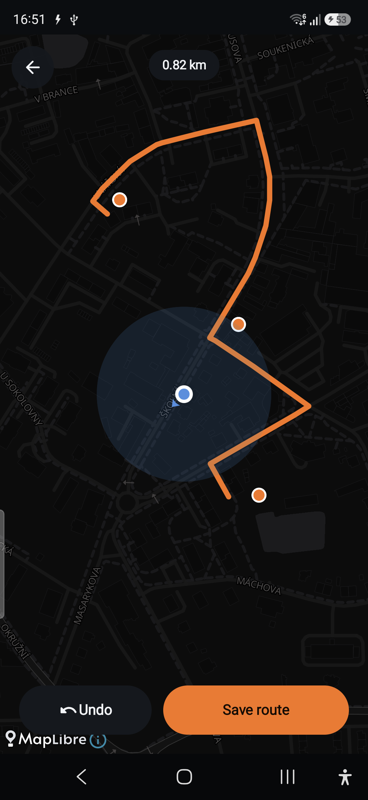
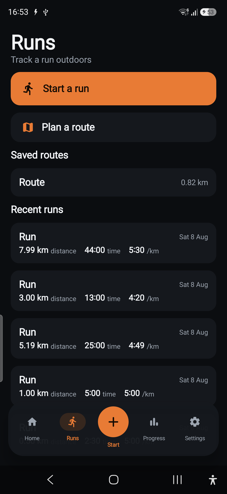
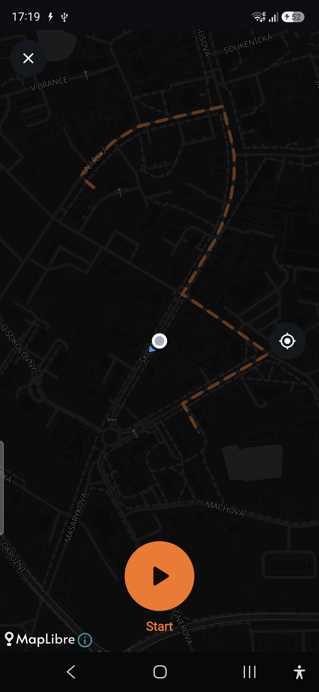
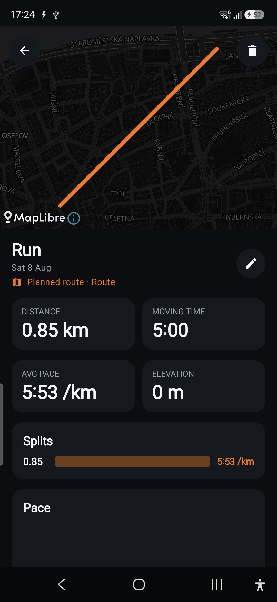

# Run Mode — Phase R3 report (Route planning + start-from-route)

**Branch:** `feature/run-mode` · **Ships toward:** v2.1.0 · **Verified on:** Galaxy A56 (`SM-A566B`, Android 16)

R3 landed: **plan a route** (tap → snap-to-roads → save) **and start a run from a saved route** with
the planned line shown as a **faint, non-binding reference** — running off it is completely fine, the
run records its own trace, and the run remembers which route it used. Additive; strength + R0–R2
untouched. Offline tile caching + route management (rename/delete) are the remaining slices (below).

## What shipped

### Routing foundation — `data/routing/`
- `RoutingClient` (interface) + `OsrmRoutingClient` — the only class that talks to a routing provider,
  so it can be swapped without touching the planner. **R3 dev uses the keyless public OSRM demo**
  (`router.project-osrm.org`, `foot` profile) — matching the map tiles' "keyless for dev" pattern;
  swap `baseUrl` for a self-hosted OSRM/Valhalla in production. HTTP via the existing OkHttp; requests
  the `full` geometry as a Google polyline.
- `OsrmRouteParser` (pure, **3 unit tests**) — decodes the OSRM response (code/geometry/distance) into
  a `SnappedRoute` using the existing `Polyline` codec, with a haversine distance fallback and safe
  rejection of non-`Ok`/empty/garbage responses. `AppContainer.routingClient` wired.

### Planner UI — `ui/run/`
- `RoutePlannerViewModel` — accumulates tapped waypoints, **re-snaps after every edit** (cancelling
  the in-flight request), exposes the snapped line + distance + a snapping flag, and saves the snapped
  polyline as a `Route` via `RunRepository.saveRoute`.
- `RoutePlannerScreen` — tap the map to drop waypoints; the snapped **ember route line** + waypoint
  markers render live; a top chip shows distance / snapping state; **Undo / Clear** and a name +
  **Save** dialog. `RunMap` gained `onMapTap` (map click → lat/lon) and a **waypoint circle layer**.
- The Runs hub gained a **Plan a route** entry and a **Saved routes** section; tapping a saved route
  **starts a run from it**.

### Start a run from a route — reference only, never binding
- `RunMap` gained a faint, **dashed planned-route underlay** drawn *beneath* the live trace, plus
  `onMapTap` + a waypoint circle layer (shared with the planner).
- `RunSessionController.armRoute(routeId)` records the linked route on the finished run; the run's
  distance/pace/trace come **only from the actual GPS** — finishing longer or shorter than the plan
  changes nothing. `LiveRunViewModel.prepareRoute` loads the planned line for the underlay.
- `domain/run/RouteDeviation` (pure, **4 unit tests**): shortest distance from the runner to the
  planned line, surfaced as a **gentle "N m off route" hint** only past ~35 m — informational, never a
  warning or a nudge back.
- The run **detail** shows a **"Planned route · <name>"** mention (a reference), while the map still
  draws the **actual trace**, not the plan.

## On-device verification (A56)

| Planner — snapped to roads | Saved routes | Run from route (faint underlay) | Detail — route mention |
|---|---|---|---|
|  |  |  |  |

Confirmed on the phone:
- Tapping three points snapped the **ember line to the real road network** via keyless OSRM (**0.82
  km**); **Save** persisted it into **Saved routes**.
- Tapping a saved route opened the run with the **planned line as a faint dashed underlay** and no
  forcing. A simulated run linked to it (`tools/run-sim.ps1 -UseRoute`) saved with a **different
  actual distance (0.85 km vs the 0.82 km plan)** — and the run **detail shows "Planned route ·
  Route"** over the **actual** trace.
- Unit tests green: `OsrmRouteParser` (3), `RouteDeviation` (4), plus the existing run suites;
  `assembleDebug` builds.

## Remaining in R3 (next slices)
- **Saved-routes management**: open a saved route (preview), rename, delete.
- **Offline tile caching** for a route's region (MapLibre offline manager) — pairs with the R5 offline
  work.
- **Elevation profile** for a planned route (routing-provider elevation or a terrain source);
  `Route.elevationGainM` is currently 0 for planned routes.

## Notes
- Routing needs network (OSRM demo); the live run itself still needs **no** network. The demo server is
  rate-limited/best-effort — production should point `baseUrl` at a self-hosted instance.
- The empty-lift **Resume** bug fixed earlier still holds — the centre shows ＋ Start here.

## Handed to the next slice
Planning, snapping, saved routes, and start-from-route (with a faint reference underlay + off-route
hint + a detail mention) are all in place. What's left in R3 is **route management** (preview/rename/
delete) and **offline tile caching**; after that R4 (Spotify) and R5 (polish incl. GPX + offline UX).
