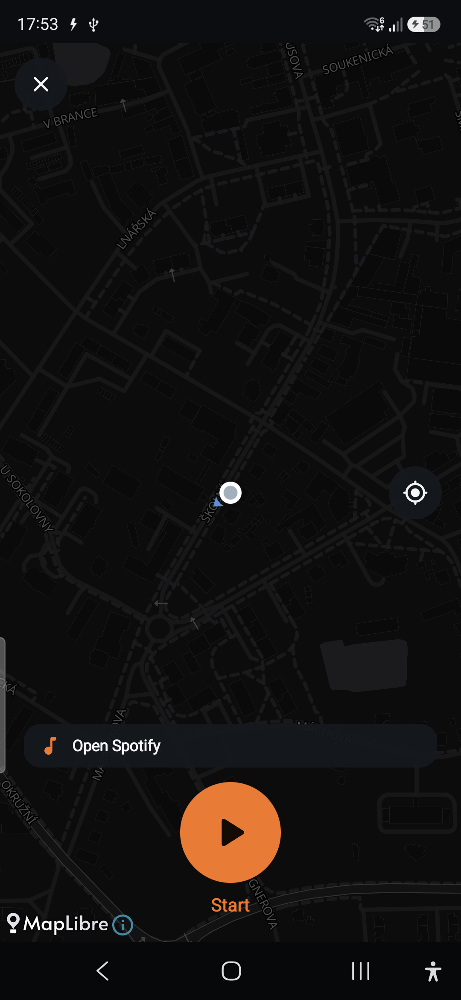
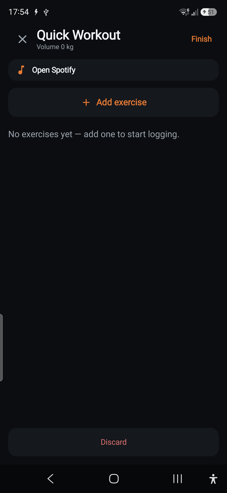

# Run Mode — Phase R4 report (Spotify — minimal, shared)

**Branch:** `feature/run-mode` · **Ships toward:** v2.1.0 · **Verified on:** Galaxy A56 (`SM-A566B`, Android 16)

R4 adds the deliberately-small, **shared** music control on **both** the live run and live lift
screens. Per the locked decision, this ships the **Open Spotify** button first (works today, no SDK or
credentials) with the transport UI (current track + play/pause · next · previous) fully wired behind a
provider interface — it lights up the moment a real App Remote binding is dropped in, with **no UI
changes**. Additive; strength + R0–R3 untouched.

## What shipped

- **`data/music/SpotifyController`** — the small seam: `available`/`track` `StateFlow`s, `connect`/
  `disconnect`, `playPause`/`next`/`previous`, and `openSpotify(context)`. No player, search, or queue
  — by design. The shipping binding is **`StubSpotifyController`**: `openSpotify` launches the Spotify
  app (falling back to the Play Store, then the web player), while `available` stays false so only the
  Open button shows. `AppContainer.spotify` holds it; manifest `<queries>` resolves the Spotify
  package for the launch intent.
- **`ui/components/MusicMiniControls`** — one composable, provided app-wide via `LocalSpotify`. It
  `connect()`s while shown and renders either the **current track + transport row** (when connected) or
  a single **Open Spotify** button (otherwise).
- **Hosted on both live screens** — `LiveRunScreen` (a bar just above the run controls) and the strength
  `LiveWorkoutScreen` (top of the exercise list). Same component, same controller.
- **Secrets hygiene** — `spotify.properties` is git-ignored, ready for the client id / redirect URI.

## On-device verification (A56)

| Live run | Live lift |
|---|---|
|  |  |

The **Open Spotify** control renders on both live screens; tapping it foregrounds Spotify (or the
store if it isn't installed). Unit tests green; `assembleDebug` builds.

## To enable transport controls (App Remote) — a pure drop-in
The transport UI is already built; enabling it needs the Spotify SDK + a client id, which only the
project owner can provide. Steps (no UI changes required):

1. **Register a Spotify app** (developer dashboard) → get a **client id** + set a **redirect URI**.
   Put them in a git-ignored **`spotify.properties`** (`SPOTIFY_CLIENT_ID=…`, `SPOTIFY_REDIRECT_URI=…`)
   and surface them via `buildConfigField` (enable `buildFeatures { buildConfig = true }`).
2. **Add the App Remote SDK** — drop `spotify-app-remote-release-*.aar` into `app/libs/` and add
   `implementation(files("libs/spotify-app-remote-release.aar"))` (+ `com.spotify.android:auth` for
   the one-time auth). Add `com.spotify.music` is already in `<queries>`.
3. **Implement `AppRemoteSpotifyController : SpotifyController`** — connect `SpotifyAppRemote` in
   `connect()`, subscribe to `PlayerState` to push `available=true` + the current `MusicTrack`, and map
   `playPause`/`next`/`previous` to the remote's `PlayerApi`.
4. **Swap the binding** — `AppContainer.spotify = AppRemoteSpotifyController(context, BuildConfig.SPOTIFY_CLIENT_ID)`.
   `MusicMiniControls` then shows the track + transport automatically.

## Notes
- No pure logic to unit-test here (the seam is all Android side-effects); the architecture calls this
  phase "deliberately small".
- If App Remote auth proves fiddly, the Open-Spotify button already satisfies the R4 exit for the
  common case; transport is an isolated follow-up.

## Handed to next
R5 (polish): audio/haptic split cues + countdown tuning, **GPX import/export**, offline tile caching
UX, a share-run card, and units/reduce-motion passes. R4's music control is shared, so any later
screen can host `MusicMiniControls()` for free.
