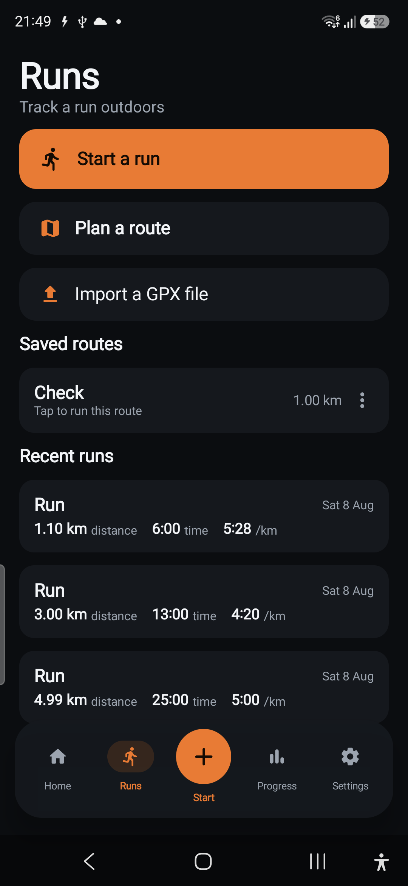
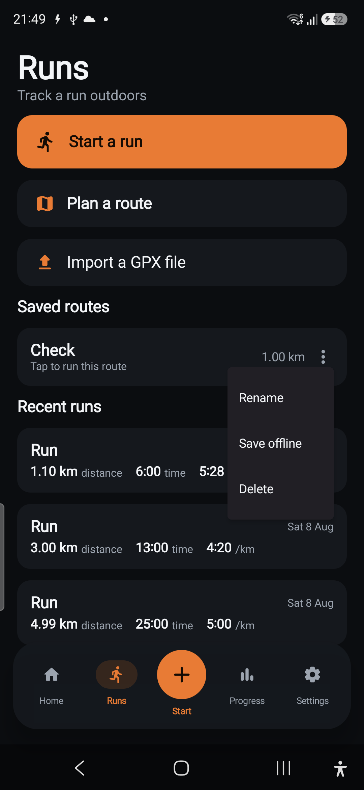
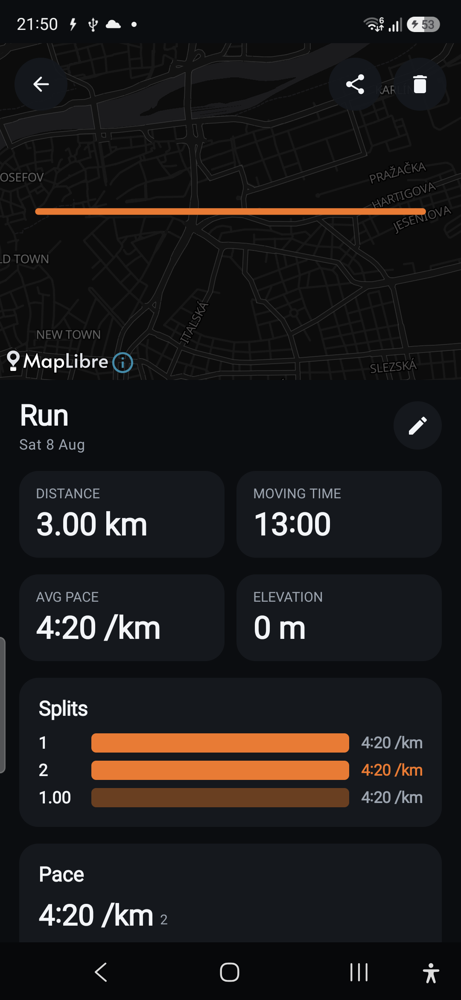
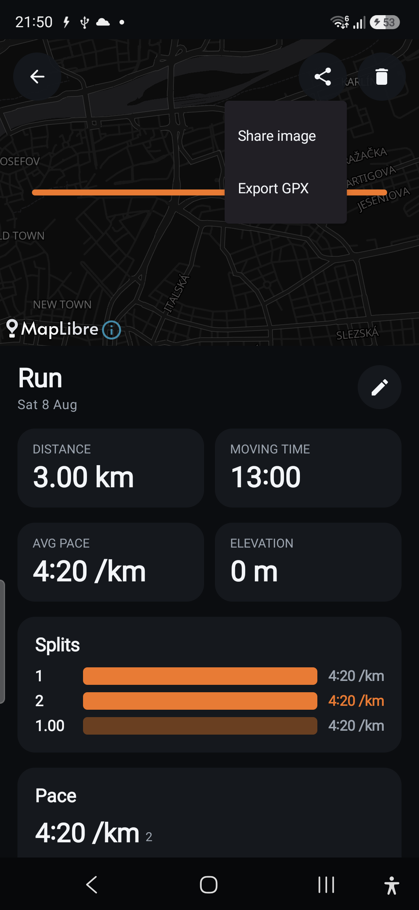
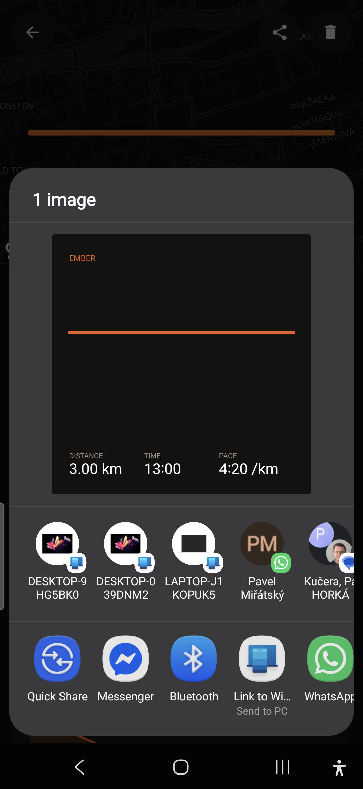
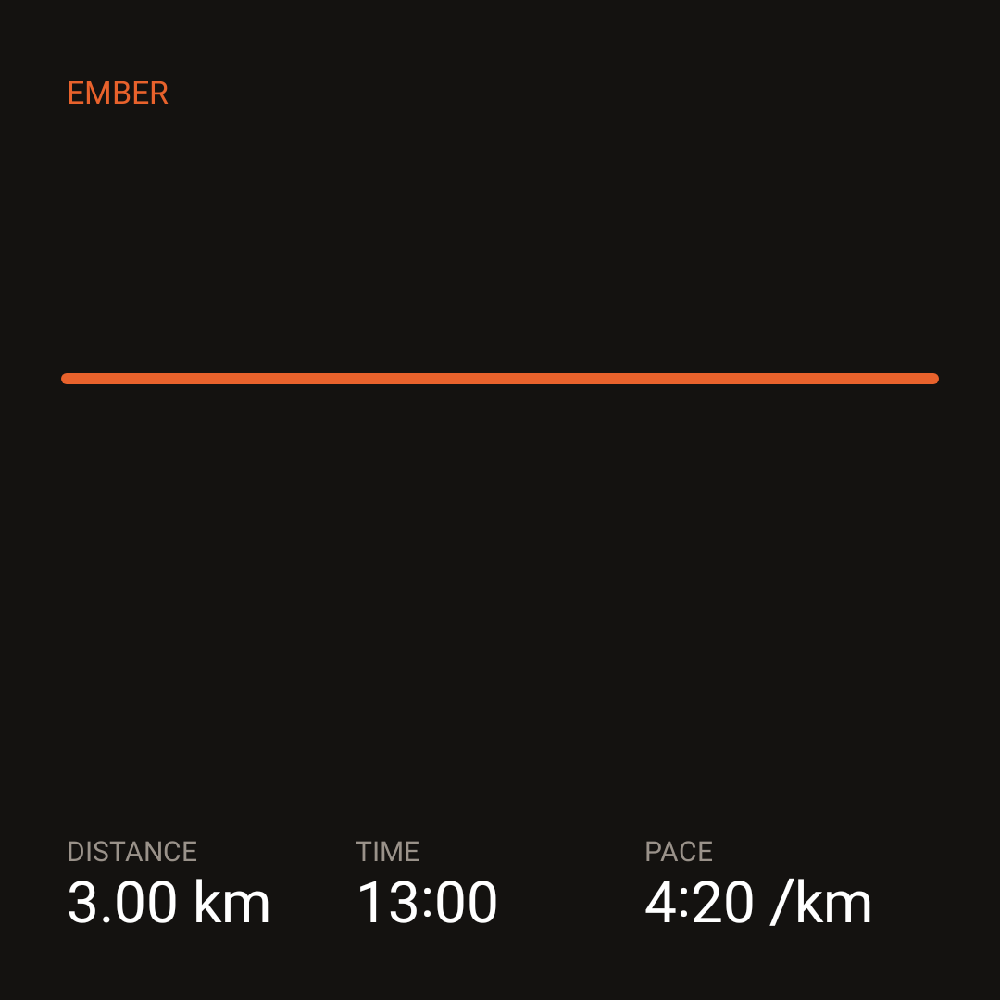

# Run Mode — Phase R5 report (Polish)

**Branch:** `feature/run-mode` · **Ships toward:** v2.1.0 · **Verified on:** Galaxy A56 (`SM-A566B`, Android 16)

R5 is the polish pass that takes Run Mode from "works" to "ships": unit-aware **audio/haptic split
cues** with a start-countdown cue and a **finish summary** (with PRs), **GPX 1.1 import/export**,
**offline tile caching**, a **share-run card** image, a **reduce-motion** pass, and the two deferred
R3 slices — **route rename/delete** and the non-intrusive **off-route** indicator. Everything is
additive; strength and the R0–R4 run flow are untouched, and the schema stays at **v5** (no migration
needed). Spotify App Remote transport stays deferred — see *Deferred* below.

## What shipped

### Cues + finish summary — a pure trigger, a thin Android player
- **`domain/run/SplitCue`** (pure, **8 unit tests**): the "a split just crossed" trigger.
  `crossedMarks(prev, curr, splitMeters)` returns the whole-split marks crossed on a step over the
  half-open range `(prev, curr]` — **unit-aware** (the caller passes a km or a mile), safe on
  backward/zero steps, and correct when one GPS jump straddles several splits. Plus a pure, unit-aware
  `spokenMessage(...)` for the announcement text.
- **`data/run/RunCues`**: the only place Run Mode touches `TextToSpeech`/`Vibrator` — turns a crossed
  mark into a spoken split + double-buzz, ticks each countdown number, and plays a finish flourish.
  Fully null-safe: a missing engine/vibrator degrades silently and never affects the run.
- **`RunStats.summarize(newRun, allRuns)`** (pure, **3 unit tests**): the finish summary — headline
  metrics + the records the run *just set*, computed by diffing `personalRecords` by run id (so a tie
  with an older run doesn't steal a badge, and a user's very first run isn't a wall of hollow PRs).
- **`LiveRunScreen`** wires it together: a `LaunchedEffect` on distance fires the unit-aware split cue,
  the countdown effect ticks + flourishes, and after Save a **summary sheet** shows distance/time/pace
  and any 🏅 records. `LiveRunViewModel.finish()` now returns the `RunSummary`.

### GPX 1.1 import/export
- **`domain/run/GpxCodec`** (pure, **5 unit tests**): `encode(Run)` → a GPX 1.1 track (`<trkpt>` with
  `<ele>`/`<time>`); `decode(gpx)` → a `Run` (`source = Imported`), deriving distance/duration/pace/
  elevation from the trace. Namespace-agnostic, XXE-hardened, and graceful about missing elevation/
  times. A run round-trips to the same geometry + timing; external (Strava-style) GPX imports cleanly.
- **UI**: run detail → **Share → Export GPX** (shares a `.gpx` via the existing `AndroidDocumentGateway`
  SAF/`FileProvider` path); Runs hub → **Import a GPX file** (SAF open → `GpxCodec.decode` →
  `RunRepository.saveRun`, with a status toast). No new file-IO code — it reuses `data/transfer`.

### Share-run card
- **`data/run/ShareCardRenderer`**: renders a 1080² PNG — the run's **trace** as an ember line on the
  near-black brand background with **EMBER** + distance/time/pace — to cache and hands back a
  `FileProvider` `ACTION_SEND` intent (same authority as exports). Geometry reuses the pure `Pace`
  math. Wired to run detail → **Share → Share image**.

### Offline tile caching (closes the deferred R3 slice)
- **`data/map/OfflineTileCache`**: wraps MapLibre's `OfflineManager` to download the tile pyramid
  (z10–16) over a padded bounds around a saved route, for the **same** dark vector style the app
  renders — so cached tiles serve the live/detail maps too. All MapLibre offline specifics live here;
  screens stay provider-agnostic. Wired to the saved-route **⋮ → Save offline** with progress toasts.

### Route management + off-route (deferred R3 slices)
- Saved routes gained a **⋮ menu**: **Rename** (dialog), **Save offline**, **Delete** (confirm), via
  new `RunViewModel.renameRoute` / `deleteRoute` / `downloadRouteOffline`.
- The **off-route** indicator from R3 (`RouteDeviation`, a gentle "N m off route" past ~35 m) is
  confirmed non-intrusive — reference only, never a warning or a nudge back.

### Reduce-motion + units
- **`ui/components/rememberReduceMotion()`** reads the OS animator-duration-scale (Settings →
  Accessibility → Remove animations). The live-run countdown drops its fade when it's on. Every new
  surface already routes distance/pace through unit-aware formatting, and the cues + share card + split
  table honour the km/mi setting.

## On-device verification (A56)

Seeded headlessly with `tools/run-mode-check.ps1 -Build -Seed -Clean` (1 route + 3 runs, one
route-linked; DB dump `runs=3 routes=1 linkedRuns=1`).

| Runs hub (import + routes) | Route ⋮ menu | Run detail (Share) | Share menu | Share sheet | Rendered card |
|---|---|---|---|---|---|
|  |  |  |  |  |  |

Confirmed on the phone:
- **Runs hub** shows **Import a GPX file** and the saved route with a **⋮** menu → **Rename / Save
  offline / Delete**.
- **Run detail** gained a **Share** control → **Share image** / **Export GPX**.
- **Share image** rendered the ember-trace card and opened the Android share sheet with a correct
  preview (3.00 km · 13:00 · 4:20 /km); the 23 KB PNG was pulled back and inspected.
- **Export GPX** wrote a valid **GPX 1.1** file on-device (121 `<trkpt>`, `creator="Ember"`, correct
  namespace, `<ele>` + `<time>` per point), pulled and inspected.
- **Tests:** `testDebugUnitTest` green — R5 adds **SplitCue** (8), **GpxCodec** (5), **RunStats
  .summarize** (3) alongside the existing suites; `assembleDebug` builds; `connectedDebugAndroidTest`
  for `RunSessionControllerTest` + `WorkoutMigrationTest` green (no schema/flow regression).

## Deferred / notes
- **Spotify App Remote transport** — still user-gated and skipped: no `app/libs/*.aar` and no
  `spotify.properties` client id are present, so per the locked decision the shipping binding stays
  `StubSpotifyController` (Open Spotify). The transport UI is already built (R4); dropping in the AAR +
  client id lights it up with no UI change. **Do not fake a remote.**
- **16 KB page alignment** (MapLibre `.so`) — the release-alignment closeout remains an item to verify
  against the packaged release; debug builds and all tests are unaffected.
- **Build caveat** (unchanged): the repo pins `buildToolsVersion = "35.0.0"`; this machine only has
  36.0.0, so it was overridden locally (uncommitted) with `local.properties sdk.dir` →
  `C:\Program Files (x86)\Android\android-sdk`. Both stay out of git.

## Handed to next
R5 completes the R0–R5 scope. Run Mode is ready to bump to **v2.1.0** and merge `feature/run-mode` →
`main`. R6 (optional/advanced) remains: BLE/Health-Connect heart rate, cadence, segments, ghost/route
racing.
